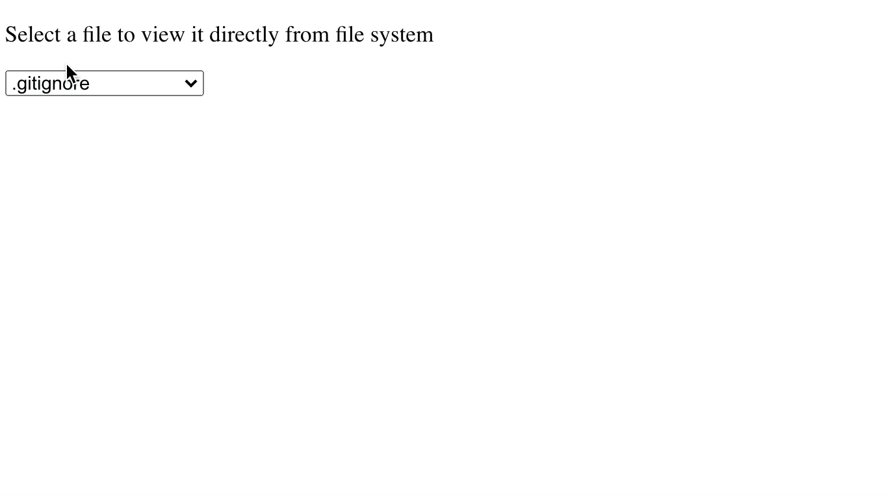

Drayman is a server-side component framework which allows you to use any available HTML element, web component or custom Drayman third-party component together with server-side code in single script.

With Drayman, browser only renders what user should see - all logic and calculations happen server-side and UI is written using JSX syntax.

Best way to show Drayman capabilities is to create something with it. So let's get started.

## File viewer component

Let's build a component which allows user to select a file from file system and view it's contents.

First, you need to install a Drayman. It can be done by running these commands:

```bash
npx @drayman/framework-init@latest my-app
cd my-app
npm start
```

Website will be available at http://localhost:3033.

If you don't want install anything, you can always try Drayman inside a CodeSandbox by visiting [new.drayman.io](http://new.drayman.io).

### Initial component template

Go to `src/components/home.tsx` and replace it's contents with this code:

```tsx title="src/components/home.tsx"
export const component: DraymanComponent = async () => {
  return async () => {
    return (
      <>
        <p>Select a file to view it directly from file system</p>
        <select></select>
        <br />
        <pre></pre>
      </>
    );
  };
};
```

You will see an initial skeleton of our component. Further `<select>` will be used to show available files and `<pre>` will show contents of the selected file.

### Filling select with options

Because Drayman runs a component server-side, we can use any Node.js library. In our case we will use `fs` module.

Let's read file names from project root directory and fill `<select>` options with them:

```tsx title="src/components/home.tsx"
import { promises as fs } from "fs";

export const component: DraymanComponent = async () => {
  //highlight-next-line
  const files = (await fs.readdir("./")).filter((x) => x.includes("."));

  return async () => {
    return (
      <>
        <p>Select a file to view it directly from file system</p>
        //highlight-start
        <select>
          {files.map((fileName) => (
            <option>{fileName}</option>
          ))}
        </select>
        //highlight-end
        <br />
        <pre></pre>
      </>
    );
  };
};
```

Right now our component is only showing some elements without any interactivity. Our next step will be to add it.

### Reacting to user actions

We need to remember which file user has selected to show it's contents. It can be done by using `onchange` event attribute and attaching a function which will be [executed server-side](http://www.drayman.io/docs/components-in-depth/handling-events). We also need to add `value` attribute to each `option` so `select` would know which option was selected.

Let's also add `fs.readFile` function inside `<pre>` tag so Drayman would read file contents during re-render. We won't show `pre` until file is actually selected:

```tsx title="src/components/home.tsx"
import { promises as fs } from "fs";

export const component: DraymanComponent = async () => {
  const files = (await fs.readdir("./")).filter((x) => x.includes("."));
  //highlight-next-line
  let selectedFile;

  return async () => {
    return (
      <>
        <p>Select a file to view it directly from file system</p>
        <select
          //highlight-start
          onchange={async ({ value }) => {
            selectedFile = value;
          }}
          //highlight-end
        >
          {files.map((fileName) => (
            //highlight-next-line
            <option value={fileName}>{fileName}</option>
          ))}
        </select>
        <br />
        //highlight-next-line
        {selectedFile && <pre>{await fs.readFile(selectedFile, "utf-8")}</pre>}
      </>
    );
  };
};
```

If you make a selection from dropdown, you will see that nothing happens on page - file contents doesn't appear. That is because with Drayman you must strictly tell when a component needs to be re-rendered. It can be done by using a special [helper function](http://www.drayman.io/docs/components-in-depth/helpers/introduction) `forceUpdate`.

Import it and add to `onchange` event after selected file was saved:

```tsx title="src/components/home.tsx"
import { promises as fs } from "fs";

export const component: DraymanComponent = async ({
  //highlight-next-line
  forceUpdate,
}) => {
  const files = (await fs.readdir("./")).filter((x) => x.includes("."));
  let selectedFile;

  return async () => {
    return (
      <>
        <p>Select a file to view it directly from file system</p>
        <select
          onchange={async ({ value }) => {
            selectedFile = value;
            //highlight-next-line
            await forceUpdate();
          }}
        >
          {files.map((fileName) => (
            <option value={fileName}>{fileName}</option>
          ))}
        </select>
        <br />
        {selectedFile && <pre>{await fs.readFile(selectedFile, "utf-8")}</pre>}
      </>
    );
  };
};
```

Now our component is complete and file contents is shown on select:


## Conclusion

We have built a component which combines server-side logic and client-side view in a single script.

If this felt interesting to you, visit [official docs](http://www.drayman.io/) to deep dive into a Drayman framework!
