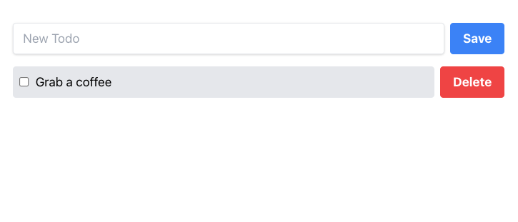
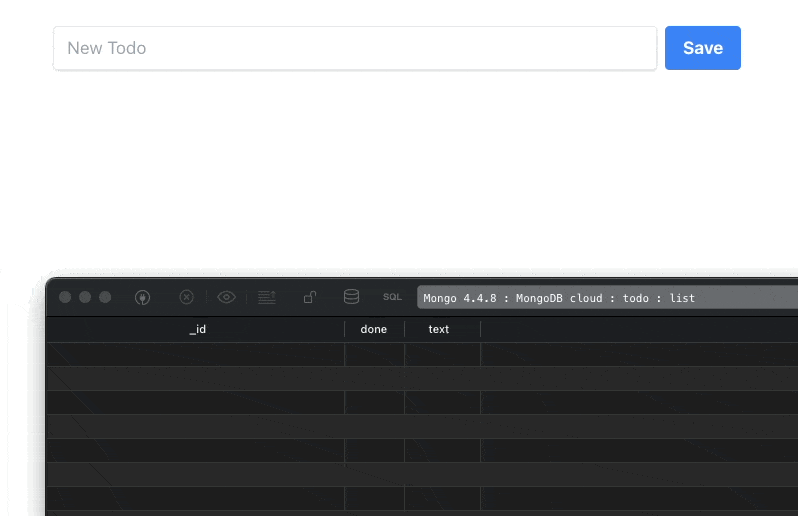
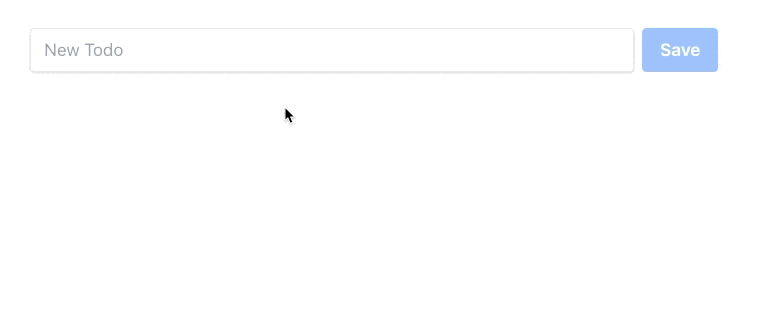
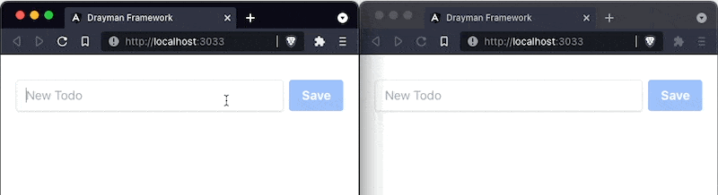

In this guide we will build a real-time Todo app with [Drayman](https://www.drayman.io/), [MongoDB](https://www.mongodb.com/) and [Tailwind CSS](https://tailwindcss.com/).

If you are using regular tools, you would need to create a server with endpoints, a client app using some modern framework or just vanilla JavaScript. With Drayman, however, it will be just a single script with 100 lines of code.

If you are new to Drayman, you can go to our [official docs](https://www.drayman.io/) to check out how it works or to read other guides.

## Prerequisites

This guide assumes that you:

- have [installed Drayman project locally](https://www.drayman.io/docs/introduction/getting-started) or you are using it through [new.drayman.io](http://new.drayman.io);
- have MongoDB installed with [Change Stream](https://docs.mongodb.com/manual/changeStreams/) functionality enabled. For this guide you can create a free cloud MongoDB database [here](https://www.mongodb.com/try). This way you get Change Stream functionality enabled by default.

When Drayman project is ready and you have MongoDB up and running, we can start developing our Todo app by adding Tailwind CSS.

## Setting up Tailwind CSS

First, you'll need to install `autoprefixer` and `tailwindcss`:

```bash
npm install -D tailwindcss@latest autoprefixer@latest
```

Next, generate `tailwind.config.js` and `postcss.config.js` files with this command:

```bash
npx tailwindcss init -p
```

Now modify `tailwind.config.js` file to exclude non-used CSS classes on compile:

```js title="tailwind.config.js"
module.exports = {
  purge: [
    // highlight-next-line
    "./src/**/*.tsx",
  ],
  darkMode: false,
  theme: {
    extend: {},
  },
  variants: {
    extend: {},
  },
  plugins: [],
};
```

Create your main CSS file at `src/styles.css` and append this code:

```css title="src/styles.css"
@tailwind base;
@tailwind components;
@tailwind utilities;
```

The final step is to modify `public/index.html` file to include the generated CSS file. Drayman will generate it to the `public/styles.css` file:

```html title="public/index.html"
<!DOCTYPE html>
<html>
  <head>
    <meta charset="utf-8" />
    <meta http-equiv="X-UA-Compatible" content="IE=edge" />
    <title>Drayman Framework</title>
    <meta name="viewport" content="width=device-width, initial-scale=1" />
    <script src="/drayman-framework-client.js"></script>
    <!-- highlight-next-line -->
    <link rel="stylesheet" href="styles.css" />
  </head>

  <body>
    <drayman-element component="home"></drayman-element>

    <script>
      initializeDraymanFramework();
    </script>
  </body>
</html>
```

## Creating a Todo app

We will start by adding basic UI using Tailwind CSS classes and then improve our solution to include real-time functionality and MongoDB support.

### Adding basic UI

Paste this code inside `src/components.home.tsx`:

```tsx title="src/components/home.tsx"
export const component: DraymanComponent = async () => {
  return async () => {
    return (
      <div class="flex justify-center items-center">
        <div class="flex flex-col pt-8 lg:w-2/5 sm:w-3/5 w-11/12 gap-4">
          <div class="flex gap-2">
            <input
              placeholder="New Todo"
              class="shadow appearance-none border rounded w-full py-2 px-3 text-gray-700 leading-tight focus:outline-none focus:shadow-outline"
            />
            <button
              class={`bg-blue-500 text-white font-bold py-2 px-4 rounded`}
            >
              Save
            </button>
          </div>
          <div class="flex items-center gap-2">
            <div
              class={`flex flex-grow items-center gap-2 bg-gray-200 p-2 rounded cursor-pointer`}
            >
              <input class="flex-none" type="checkbox" />
              <div class="flex-grow">Grab a coffee</div>
            </div>
            <button class="flex-none bg-red-500 hover:bg-red-700 text-white font-bold py-2 px-4 rounded">
              Delete
            </button>
          </div>
        </div>
      </div>
    );
  };
};
```

If Tailwind CSS was successfully initialized, you should see this result in your browser:



### Adding MongoDB support

For this guide we will use [Change Stream](https://docs.mongodb.com/manual/changeStreams/) functionality of MongoDB to make our Todo list work in real-time. This way if something gets changed in the database, our application will reflect these changes. Let's modify our `src/components/home.tsx` component and see in detail what is happening inside our script:

```tsx title="src/components/home.tsx"
import { MongoClient, ObjectId } from "mongodb";

interface Todo {
  _id: ObjectId;
  text: string;
  done: boolean;
}

export const component: DraymanComponent = async ({
  forceUpdate,
  ComponentInstance,
}) => {
  const uri = "YOUR_MONGODB_CONNECTION_STRING";
  const client = new MongoClient(uri);
  await client.connect();
  const db = client.db("todo");
  const todoListCollection = db.collection<Todo>("list");

  let todos = await todoListCollection.find().toArray();

  todoListCollection.watch().on("change", async (x) => {
    if (x.operationType === "insert") {
      todos.push(x.fullDocument as Todo);
    } else if (x.operationType === "update") {
      todos = todos.map((todo) => {
        if (todo._id.equals(x.documentKey._id)) {
          return { ...todo, ...x.updateDescription.updatedFields };
        }
        return todo;
      });
    } else if (x.operationType === "delete") {
      todos = todos.filter((todo) => !todo._id.equals(x.documentKey._id));
    }
    await forceUpdate();
  });

  ComponentInstance.onDestroy = async () => {
    await client.close();
  };

  return async () => {
    return (
      <div class="flex justify-center items-center">
        <div class="flex flex-col pt-8 lg:w-2/5 sm:w-3/5 w-11/12 gap-4">
          <div class="flex gap-2">
            <input
              placeholder="New Todo"
              class="shadow appearance-none border rounded w-full py-2 px-3 text-gray-700 leading-tight focus:outline-none focus:shadow-outline"
            />
            <button class="bg-blue-500 text-white font-bold py-2 px-4 rounded">
              Save
            </button>
          </div>
          {todos.map((x) => (
            <div class="flex items-center gap-2">
              <div
                class={`flex flex-grow items-center gap-2 ${
                  x.done ? `bg-green-200 line-through` : `bg-gray-200`
                } p-2 rounded cursor-pointer`}
              >
                <input class="flex-none" checked={x.done} type="checkbox" />
                <div class="flex-grow">{x.text}</div>
              </div>
              <button class="flex-none bg-red-500 hover:bg-red-700 text-white font-bold py-2 px-4 rounded">
                Delete
              </button>
            </div>
          ))}
        </div>
      </div>
    );
  };
};
```

First, we have added a connection to our database (don't forget to change `YOUR_MONGODB_CONNECTION_STRING` to your actual connection string). Then we made the initial fetch of our Todo list by converting it to an array - `let todos = await todoListCollection.find().toArray();`.

Then we added real-time functionality by watching for changes to database `todoListCollection.watch()`:

- on `insert` a Todo will be pushed to `todos` array;
- on `update` a specific Todo from `todos` array will be updated;
- on `delete` a specific Todo from `todos` array will be deleted.

The component will reflect all these changes because we also call the [forceUpdate](https://www.drayman.io/docs/components-in-depth/helpers/force-update) function - if any change gets caught, the component will re-render itself.

Finally, we are using the [onDestroy](https://www.drayman.io/docs/components-in-depth/helpers/the-component-instance-object) lifecycle method to close the connection to the database when a component instance gets destroyed.

We also have made changes to our UI by mapping through `todos` array and rendering each Todo and changing CSS classes dynamically when a Todo is done.

As a result, any change made inside the database (I am using [TablePlus](https://tableplus.com/) for this), gets reflected inside our component:



Our final step will be to make the input field and buttons work as expected.

### Adding functionality to UI elements

We will start by modifying the `<input>` element:

```tsx title="src/components/home.tsx"
// ...
let newTodo: string;
// ...

return async () => {
  return (
    // ...
    <input
      placeholder="New Todo"
      class="shadow appearance-none border rounded w-full py-2 px-3 text-gray-700 leading-tight focus:outline-none focus:shadow-outline"
      value={newTodo}
      oninput={async ({ value }) => {
        newTodo = value;
        await forceUpdate();
      }}
    />
    // ...
  );
};
```

The variable `newTodo` was introduced. When the user types in something, the `oninput` event gets triggered that saves the input value to the `newTodo` variable thus providing a single source of truth - the input's value will always be inside `newTodo`.

Let's now modify the `<button>Save</button>` element:

```tsx title="src/components/home.tsx"
<button
  class={`bg-blue-500 text-white font-bold py-2 px-4 rounded ${
    newTodo ? `hover:bg-blue-700` : `opacity-50 cursor-not-allowed`
  }`}
  disabled={!newTodo}
  onclick={async () => {
    await todoListCollection.insertOne({ text: newTodo, done: false });
    newTodo = null;
  }}
>
  Save
</button>
```

We have modified `class` and `disabled` attributes to appear disabled when there is no input by the user (`newTodo` is empty). When the user clicks a button, `onclick` gets triggered and a new Todo gets inserted into the database. We also don't need to call `forceUpdate` here because it already was managed before when watching for database changes. Now we can input something, click the button and the result will appear in the browser:



Our final step will be to modify `todos` list mapping:

```tsx title="src/components/home.tsx"
todos.map((x) => (
  <div class="flex items-center gap-2">
    <div
      onclick={async () => {
        await todoListCollection.updateOne(
          { _id: x._id },
          { $set: { done: !x.done } }
        );
      }}
      class={`flex flex-grow items-center gap-2 ${
        x.done ? `bg-green-200 line-through` : `bg-gray-200`
      } p-2 rounded cursor-pointer`}
    >
      <input class="flex-none" checked={x.done} type="checkbox" />
      <div class="flex-grow">{x.text}</div>
    </div>
    <button
      class="flex-none bg-red-500 hover:bg-red-700 text-white font-bold py-2 px-4 rounded"
      onclick={async () => {
        await todoListCollection.deleteOne({ _id: x._id });
      }}
    >
      Delete
    </button>
  </div>
));
```

Here we have added the `onclick` event handler for `<div>` to mark a Todo done or undone and the `onclick` event handler for `<button>Delete</button>` to delete a Todo from the database when it is clicked.

Our component is now complete and you can open a page with this component in multiple tabs to check real-time functionality:



### Final component script

```tsx title="src/components/home.tsx"
import { MongoClient, ObjectId } from "mongodb";

interface Todo {
  _id: ObjectId;
  text: string;
  done: boolean;
}

export const component: DraymanComponent = async ({
  forceUpdate,
  ComponentInstance,
}) => {
  const uri = "YOUR_MONGODB_CONNECTION_STRING";
  const client = new MongoClient(uri);
  await client.connect();
  const db = client.db("todo");
  const todoListCollection = db.collection<Todo>("list");

  let todos = await todoListCollection.find().toArray();
  let newTodo: string;

  todoListCollection.watch().on("change", async (x) => {
    if (x.operationType === "insert") {
      todos.push(x.fullDocument as Todo);
    } else if (x.operationType === "update") {
      todos = todos.map((todo) => {
        if (todo._id.equals(x.documentKey._id)) {
          return { ...todo, ...x.updateDescription.updatedFields };
        }
        return todo;
      });
    } else if (x.operationType === "delete") {
      todos = todos.filter((todo) => !todo._id.equals(x.documentKey._id));
    }
    await forceUpdate();
  });

  ComponentInstance.onDestroy = async () => {
    await client.close();
  };

  return async () => {
    return (
      <div class="flex justify-center items-center">
        <div class="flex flex-col pt-8 lg:w-2/5 sm:w-3/5 w-11/12 gap-4">
          <div class="flex gap-2">
            <input
              placeholder="New Todo"
              class="shadow appearance-none border rounded w-full py-2 px-3 text-gray-700 leading-tight focus:outline-none focus:shadow-outline"
              value={newTodo}
              oninput={async ({ value }) => {
                newTodo = value;
                await forceUpdate();
              }}
            />
            <button
              class={`bg-blue-500 text-white font-bold py-2 px-4 rounded ${
                newTodo ? `hover:bg-blue-700` : `opacity-50 cursor-not-allowed`
              }`}
              disabled={!newTodo}
              onclick={async () => {
                await todoListCollection.insertOne({
                  text: newTodo,
                  done: false,
                });
                newTodo = null;
              }}
            >
              Save
            </button>
          </div>
          {todos.map((x) => (
            <div class="flex items-center gap-2">
              <div
                onclick={async () => {
                  await todoListCollection.updateOne(
                    { _id: x._id },
                    { $set: { done: !x.done } }
                  );
                }}
                class={`flex flex-grow items-center gap-2 ${
                  x.done ? `bg-green-200 line-through` : `bg-gray-200`
                } p-2 rounded cursor-pointer`}
              >
                <input class="flex-none" checked={x.done} type="checkbox" />
                <div class="flex-grow">{x.text}</div>
              </div>
              <button
                class="flex-none bg-red-500 hover:bg-red-700 text-white font-bold py-2 px-4 rounded"
                onclick={async () => {
                  await todoListCollection.deleteOne({ _id: x._id });
                }}
              >
                Delete
              </button>
            </div>
          ))}
        </div>
      </div>
    );
  };
};
```

## Conclusion

We have created a real-time Todo app with Drayman, MongoDB and Tailwind CSS in just 100 lines of code, inside a single script.

If this felt interesting to you, visit the [official docs](https://www.drayman.io/) to deep-dive into Drayman framework!
